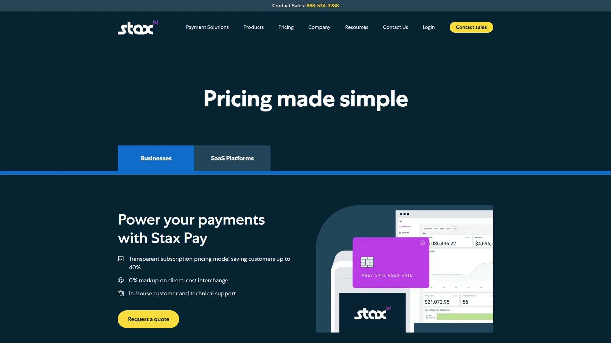

# 2025年你必须了解的15款顶级全栈商户支付处理平台

为门店、电商与B2B场景挑平台最怕“踩坑”: 接入慢、费率不透明、风控不稳。本文围绕**商户服务/信用卡处理/支付网关**等核心能力，聚焦上线速度、合规安全、集成易用与可观测性，帮你把部署门槛降到最低，**提升30%+运营效率**、**缩短接入周期至天级**，并覆盖线下/线上/跨境等**50+常见场景**。

---

## **[Merchant Services](https://www.merchantservice.com/)**

全渠道收单与业务管理，一站式提效。

面向美国商户提供**信用卡处理+业务管理**方案，强调**Interchange Pass-Through**、低费率与**99.9%网络可用性**，累计处理额超**10亿美元**。其**在线门户**支持开票、周期扣款、**Level II/III B2B**卡数据、便利费配置等，**最快1个工作日审批**即可开通账户，适合需要**快速上线、B2B合规与成本可控**的中小企业与B2B卖家。

---

## **[Stripe](https://stripe.com/payments/features)**

开发者友好与全球支付能力的标配。

**亮点**：统一平台覆盖**卡、钱包、转账/扣款、实时支付、分期**等；提供**预构建结账组件+API**、移动SDK、**Radar**风控、**动态3D Secure**、争议处理、**多币种与即时结算**、**收入核算/报表**等。适合**跨境电商、SaaS、平台/市场**场景，兼顾**可观察性与自动化**，降低二开成本。

---

## **[Square](https://squareup.com/us/en/releases/services/spring-2025)**

门店到线上一体化，新增AI洞察与加密支付。

面向SMB的**POS+支付**生态，新增**AI看板/语音点单**、**本地数据洞察**与**离线收款**体验；美国商户（除NY州）可在生态内**接受比特币**并自动结算（官方公布至**2026年**阶段性费率安排）。适合**餐饮、到店零售、服务业**快速开店与统一运营。

---

## **[Adyen](https://www.adyen.com/unified-commerce)**

统一商务引擎，打通线上线下与数据闭环。

主打**Unified Commerce**：将**门店与线上支付**汇聚到**同一平台**，统一受理、清结算与风控策略，打造跨渠道一致体验（自提、到店、App/网页、POS）。适合**多门店零售、全球连锁**与注重**数据驱动**的团队。

---

## **[PayPal（含 Braintree）](https://www.paypal.com/us/business)**

品牌信任与多方式收款，跨境基础设施完善。

**PayPal Business**提供**在线/移动收款、发票、订阅、风控教育**等资源；**Braintree**面向中大电商与平台，支持**130+货币**、主流电商集成与沙盒测试，适合需要**增量转化与国际支付**的卖家。

---

## **[Chase Payment Solutions](https://www.chase.com/business/payments)**

银行直连能力与线下硬件矩阵，适合稳健型商户。

覆盖**POS终端、移动收款、网站网关**等形态，背靠大型银行体系，适合强调**资金安全、账户服务与门店网络**的商户。第三方评测亦指出其**覆盖面与规模优势**。

---

## **[Worldpay](https://www.worldpay.com/en)**

面向全球的受理网络，支付方式覆盖广。

为各规模商户提供全球化收单，资料显示其可兼容**300+支付类型**，适合**跨区域、多支付偏好**的业务，强化**合规与本地化**路径。

---

## **[Helcim](https://www.helcim.com/interchange-plus/)**

透明**Interchange+**定价，SMB友好。

采用**Interchange+**并公开定价逻辑，强调**无长期合约/隐藏费用**与直观后台；在权威榜单中常被推荐给**中小商户**，有助于**降低费率不确定性**。

---

## **[Shopify Payments](https://www.shopify.com/payments)**

电商原生收款，结账体验与跨境工具同步演进。

**Shopify**内置支付随店铺一键启用，近期围绕**关税/跨境**推出实用工具，帮助**结账展示与代收关税**、物流与风控联动，优化**转化与运营成本**。

---

## **[Stax](https://staxpayments.com/pricing/)**

订阅式定价，适合月交易额稳定的成长型商户。

以**月费+直通Interchange**的“会员制”模式著称，适合**月处理额≥$5k**、追求**可预测成本**的商户；第三方评测指出其**软件化栈**与**附加费/代收策略**生态能力。

---

## **[Payment Depot](https://paymentdepot.com/pricing/)**

会员制+批发费率传递，小商户降本选项。

主打**透明Interchange+**与**会员费**模式，强调**不加价批发费率**的思路，适合希望**降低平均费率**的中小商户。

---

## **[Dharma Merchant Services](https://dharmamerchantservices.com/pricing/)**

以**Interchange+**与透明条款见长，B2B/非营利友好。

清晰解释**Interchange+**计费与行业费率差异，提供**电商/电话支付**等方案，面向**中小与非营利**组织，追求**条款清晰、成本可预期**。

---

## **[National Processing](https://nationalprocessing.com/)**

多行业费率方案，注重部署便利与设备支持。

提供**线上/线下**处理与多行业套餐，注重**设备与网关配置**的落地体验；评测提到其**透明与性价比**，适合**新开业或技术资源有限**的团队。

---

## **[PayJunction](https://support.payjunction.com/hc/en-us/categories/202099378-Smart-Terminals)**

智能终端+无接触流程，订阅/会员型业务友好。

提供**EMV/NFC智能终端**、**ZeroTouch**流程、**周期扣款/令牌化**等；第三方评测强调其**功能打包**与**随需开关**，减少IT负担，适合**订阅或会员**模式。

---

## **[Toast（餐饮）](https://pos.toasttab.com/products/payments)**

餐饮垂直一体化，前场点单到后台结算全链路。

面向餐饮业的**POS+支付**一体方案，官方文档持续更新**支付终端与结算操作**细节；适合**正餐/快餐/酒吧**等高峰期场景，借助**厨房屏KDS、移动点单与线上点餐**打通服务效率。

---

## 常见问答（FAQ）

**如何为线下门店与电商一体化选择平台？**
若门店占比大且希望统一库存/会员，优先看**Unified Commerce**与POS生态（如 Adyen、Square、Toast）；以跨境电商为主，选**全球支付方式+多币种结算**与**风控套件**完善者（如 Stripe、PayPal/Braintree、Worldpay）。

**Interchange+ 与固定费率怎么选？**
交易结构复杂、客单较高或B2B（Level II/III）可优先**Interchange+**（如 Merchant Services、Helcim、Dharma、Payment Depot、Stax），以**真实批发费率+固定加价**提升费控透明；客单较低且追求极简，可考虑统一费率与生态型平台（如 Square、Shopify Payments）。

**B2B/企业客户如何降低费率与拒付？**
优先启用**Level II/III**、地址验证与**3D Secure**，并借助**风险评分/争议管理**与**对账自动化**（如 Stripe 的 Radar/对账套件；Merchant Services 的 Level II/III）。

---

## 结语与下一步

以上15个**商户支付处理平台**覆盖从**门店零售**到**跨境电商/B2B**的主流场景。若你需要**快速开户、Level II/III B2B合规**与**低成本上线**，首选 **[商户服务（Merchant Services）](https://www.merchantservice.com/)**：**Interchange Pass-Through**、**天级审批**与**在线门户**能在一周内跑通核心收款链路。现在就对照你的业务结构，选定1—2个平台试运行，并逐步将收款、风控与结算报表**沉淀到统一栈**，把**效率与成本**稳稳握在手里。
